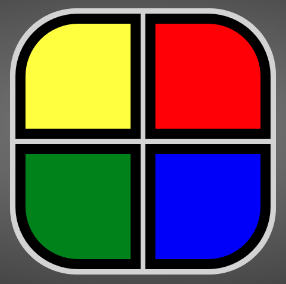

<div align="center">




# WELCOME TO SIMON SAYS
### Built by: **[Ryan Q Le](https://www.linkedin.com/in/ryanqle/)**

[](https://GitHub.com/Naereen/StrapDown.js/graphs/commit-activity)


## **[CLICK HERE TO PLAY](https://ryanqle.github.io/SimonSays/)**
</div>

## What is Simon Says

Simon Says is a short-term memory skill game. There are four buttons that produce their own color and sound. A round consist of repeating the computer's random sequence in the correct order. As the game progresses, so does the difficulty.


<br />

## How to Play

1. Press the `START` button.
2. The `COMPUTER` will play the color sequence.
3. On `PLAYER` turn, choose the colors in the correct sequence.
4. If correct, the `COMPUTER` will play the next sequence.
5. `PLAYER` will lose once the inputted sequence is not correct
6. To play again, hit the `RESTART` button.

<br />
<div align="center">


</div>
<br />

### Features Added


| Features |  |
| --- | --- |
| Introduction | Animation and music for when game is started |
| Guard | Player will be unable to interact with the buttons during the computer's turn |
| Audio | Buttons will play a note for the seeing impaired |
| `Mute` Button | Allows users to mute all audio from the game |

### Planned Updates & Known Bugs

Please feel free to reach out and send issues about suggestions or bugs!

<br />

| Updates | Bugs |
| :---:  | :---: |
| Add Settings Menu | Audio sound on mobile is inconsistent |
| Color Blind Option |
| Additional Difficulty Settings |
| High Score Tracker |
<br />

### About This Project
Written for **General Assembly Software Engineering Immersive Bootcamp**

The thought process behind this game is to emulate the Hasbro Simon Game. It has the game pad and reactive buttons that light up with sound.

This is my first project utilizing JS and manipulating the DOM. One challenging aspect was having the glow effect added to the game pad without clipping other elements.

Favorite snippet of code: A while loop to iterate through the computer's sequence.

```JS
function playSequence(sequence) {
    infoDisplay.innerText = `Wait for computer to play`;
    while (index !== sequence.length) {
        arrOfColors.forEach((color) => {
            if (sequence[index] === color.id) {
                let colorIdx = arrOfColors.indexOf(color);
                setTimeout(() => {
                    arrOfColors[colorIdx].style.borderColor = 'white';
                    audio[colorIdx].play();
                    arrOfGlow[colorIdx].style.visibility = 'visible';
                }, (index + 1) * timeoutTime);
                setTimeout(() => {
                    arrOfColors[colorIdx].style.borderColor = 'black';
                    arrOfGlow[colorIdx].style.visibility = 'hidden';
                    audio[colorIdx].pause();
                    audio[colorIdx].currentTime = 0;
                }, (index + 1.75) * timeoutTime);
                clearTimeout();
            }
        });
        index++;
    }
    index = 0;
    playerTurn();
}
```

